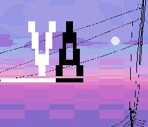

# GlitchVape



> **This is an entirely vibe-coded application.** It is a tool for me, the
> author, aimed at simplifying the application of filters and transformations.


Vaporwave and glitch-art transformations for photographs. Reads PNG, JPEG and
HEIC; writes stills or short looping animations.

```bash
glitchvape --preset vhs-decay Pictures/IMG_8111.HEIC
```

---

## Install

Debian 13 / WSL:

```bash
sudo apt update && sudo apt install -y \
  imagemagick libimage-magick-perl \
  ffmpeg libheif-examples \
  pngquant gifsicle webp libimage-exiftool-perl \
  libpath-tiny-perl libjson-perl libyaml-libyaml-perl \
  libtry-tiny-perl libcapture-tiny-perl libfile-which-perl \
  libparallel-forkmanager-perl libmoo-perl libtest-deep-perl \
  fonts-noto-cjk fonts-ipafont fonts-vlgothic fonts-mplus fonts-misaki \
  fonts-terminus fonts-unifont fonts-cascadia-code fonts-hack
```

Check what the tool can actually see:

```bash
./bin/glitchvape --check-deps
./bin/glitchvape --check-fonts
```

Only `imagemagick` and `libimage-magick-perl` are strictly required. Everything
else degrades gracefully: without `ffmpeg` you lose animation, without
`pngquant` the quantiser falls back to ImageMagick's, without CJK fonts the
text effects report which package would fix it.

### For the graphical interface

`glitchvape-gui` is optional and needs nothing that the command-line tool does:

```bash
sudo apt install -y libgtk3-perl libgtk3-imageview-perl
```

Plus, for the animated preview and for auditioning an audio track:

```bash
sudo apt install -y gir1.2-gstreamer-1.0 gstreamer1.0-plugins-good \
  gstreamer1.0-gtk3 gstreamer1.0-libav
```

GTK 3 rather than 4 because Debian has no `libgtk4-perl` — GTK 4 from Perl
would mean raw `Glib::Object::Introspection` without the API overrides
`Gtk3.pm` provides. GStreamer is reached through introspection because Debian
dropped the Perl binding years ago; the typelib is the same library.

Without these, `glitchvape-gui` prints the one `apt` line that fixes it and
exits. The animated preview is checked separately and only when first asked
for, so a machine with GTK but no GStreamer runs the still interface normally.

### Fedora

There is a spec file, so the shortest route is a package:

```bash
sudo dnf install -y rpm-build perl-macros
sudo dnf builddep -y package/glitchvape.spec   # what BuildRequires names
make rpm                                # the three binary packages
```

`make srpm` builds only the source package, and `make rpms` builds both. All
three go through the tarball rather than the spec in the tree, so a file
`make dist` forgot is a build failure rather than a package quietly missing
something.

Output lands wherever `rpmbuild` would have put it, `~/rpmbuild/RPMS`.
`RPMTOPDIR` moves it:

```bash
make rpm RPMTOPDIR=$PWD/build-rpm       # build without touching $HOME
make rpm RPMFLAGS='--nodeps --nocheck'  # skip BuildRequires and the tests
```

The last one proves the packaging rather than the program: `--nocheck` skips
the `%check` section, which is where the test suite runs.

Or build straight out of a checkout:

```bash
sudo dnf install -y ImageMagick ImageMagick-perl perl-File-Which \
  ffmpeg-free pngquant gifsicle perl-Image-ExifTool libheif-tools \
  dejavu-sans-fonts google-noto-sans-cjk-fonts cascadia-code-fonts \
  terminus-fonts ipa-gothic-fonts
sudo dnf install -y perl-Gtk3 perl-Gtk3-ImageView \
  perl-Glib-Object-Introspection            # for the window
sudo dnf install -y gstreamer1 gstreamer1-plugins-base \
  gstreamer1-plugins-good gstreamer1-plugins-good-gtk   # animated preview
```

`ffmpeg-free` is what Fedora ships; RPM Fusion's `ffmpeg` works too, which is
why the spec asks for `/usr/bin/ffmpeg` rather than for either package by
name. There is no Fedora package for Misaki, so the `pixel` role falls through
to Terminus.

### Debian and Ubuntu

There is a `package/debian/` directory, so the shortest route is again a
package:

```bash
sudo apt install -y build-essential debhelper devscripts
make deb
```

Three come out, in the parent directory:

| | |
|---|---|
| `glitchvape` | the library and the command-line tools |
| `glitchvape-gui` | the Gtk3 window |
| `glitchvape-fonts-extra` | one typeface, `non-free/fonts` |

The third is separate because of what is written above about W95FA: its terms
are a font aggregator's description rather than a document, which is not
enough for a package that claims MIT and OFL on the tin. `glitchvape` only
*suggests* it, and the `ui` role falls through to DejaVu without it.

`package/debian/README.Debian` has the detail, including the one thing this packaging
cannot do as it stands: a source package in main may not contain non-free
content, and this one carries `assets/fonts-nonfree/`. Built locally or in a
PPA it is fine; an upload to Debian proper would need either the licence
settled — at which point the font moves up and the third package disappears —
or the tarball repacked, for which `package/debian/copyright` already carries a
commented-out `Files-Excluded` line.

The packaging drives the same `Makefile` the RPM spec does, rather than
restating where anything goes, and `package/debian/rules` installs one binary package
at a time from the targets the Makefile already splits — which is why there
are no `.install` files here. `make check-split`, `make check-licenses` and
the test suite all run during the build.

#### Packaging layout

Everything a distribution needs lives in `package/` — the RPM spec, `debian/`,
the desktop entry and the AppStream metadata — and everything the packaging
targets produce lands in `build/`, which is gitignored and which `make clean`
removes whole. A build writes nothing into the source tree.

Both packagings build from the tarball `make dist` writes there. `rpmbuild -t`
finds `package/glitchvape.spec` inside it; `make deb` unpacks the tarball and
moves `package/debian` into place, because `dpkg-buildpackage` insists on a
`debian/` directly beneath the directory it runs in. Building from the tarball
rather than in the tree means a file `make dist` failed to include is a build
failure rather than a package quietly missing something.

Installed, the modules go to `%{perl_vendorlib}` — `/usr/share/perl5` on
Debian — and the data to
`/usr/share/glitchvape`, which are nowhere near each other — so the walk-up
from `__FILE__` that finds `assets/` and `presets/` in a checkout finds
nothing. `GlitchVape::Paths` is the one constant naming the installed data
directory, and `make install` rewrites it. In a checkout it is empty, which
means "not installed" and sends both callers back to the walk-up, so a
checkout behaves exactly as it did before that module existed.

The window is a separate subpackage. `make check-split` asserts that nothing
outside the GUI module set reaches for Gtk3, which is what makes
`glitchvape` installable on a machine that will never open one — and both
builds run that assertion rather than trusting it.

Fonts are split the same way and for a licensing rather than a technical
reason: `assets/fonts/` ships in the base package and `assets/fonts-nonfree/`
in `glitchvape-fonts-extra`. Both are on the search path, so which package is
installed changes what `--check-fonts` resolves and nothing else.

Manual pages are generated from the tools' own POD at install time rather than
committed, so `man glitchvape` and `glitchvape --help` cannot document
different flags — `pod2usage` reads the same block.

The launcher icon is not. `assets/artwork/icon-256.png` is committed, because
generating it needs ImageMagick and installing should not. It is the middle
185×185 of the 215×185 logo, enlarged to 256 — cropped rather than padded,
since a launcher draws it at 48 pixels and white bars top and bottom would
spend a third of that on nothing:

```bash
magick assets/artwork/logo.png -gravity center -crop 185x185+0+0 +repage \
    -filter point -resize 256x256! -strip assets/artwork/icon-256.png
```

`-filter point` is the part that matters. The logo is 16-colour pixel art, and
any smooth filter resamples it into some three and a half thousand blended
colours and softens every edge — which is exactly the character the thing is
made of. The same reasoning is why the about window shows the logo unscaled.

### Optional fonts

Debian has no package for the classic camcorder faces. Drop `.ttf`/`.otf`
files into `assets/fonts/` — creating it if this is a fresh clone, since the
directory is gitignored — and they are picked up automatically, ahead of
anything installed system-wide. Subdirectories are searched too, so an
upstream release can be unpacked whole — licence, README and all — rather than
having its font files picked out of it; the top level is searched first, so a
loose file still wins over one in a folder beneath it.

Only what FreeType can load counts: `ttf`, `otf`, `ttc`, `pcf`, `bdf`. The
`woff`/`woff2` files that font releases carry for the web are ignored, because
ImageMagick cannot render from them — there is no reason to keep them here.

| Font | Role | Where | Licence |
|---|---|---|---|
| **VCR OSD Mono** | `vcr` | [dafont.com/vcr-osd-mono.font](https://www.dafont.com/vcr-osd-mono.font) | free, [including commercial use](https://www.dafont.com/font-comment.php?file=vcr_osd_mono) |
| **Departure Mono** | `vcr`, `pixel` | [departuremono.com](https://departuremono.com) | OFL 1.1 |
| **Fusion Pixel** | `pixel` | [github.com/TakWolf/fusion-pixel-font](https://github.com/TakWolf/fusion-pixel-font) | OFL 1.1 |
| **W95FA** | `ui` | [dafont.com/w95fa.font](https://www.dafont.com/w95fa.font) | *unverified* — dafont says OFL; no licence text came with it |

Three of the four are in the repository, under `assets/fonts/`, each unpacked
as its author published it with the statement of terms beside the font. That
is not tidiness: `glitchvape --licenses` and the about window read those files
off disk rather than quoting a copy pasted into Perl, which is how the OFL's
"the licence travels with the font" is satisfied by the actual document.

W95FA is the fourth, and it is in `assets/fonts-nonfree/` instead. dafont
describes it as OFL and free for personal and commercial use, but the download
carries no licence text and no statement by its author has been found that can
be cited — a claim about the terms rather than the terms. So it is packaged on
its own, as `glitchvape-fonts-extra`, and the base package can say *MIT and
OFL-1.1 and VCR OSD Mono's grant* and mean it.

Both directories are on the font search path, so a checkout finds every font
either way and the split is invisible to everything but the packaging. Adding
a font is a line in `.gitignore` plus its licence beside it; `make
check-licenses` reports what the rule concluded and fails if a font arrived
without one.

VCR OSD Mono was in the second directory until its author was asked directly,
in the font's own comment thread: *"Yes, the font is free even for commercial
purposes."* That is an unconditional grant with no SPDX identifier, so both
packagings name it as a `LicenseRef` pointing at the file that records it. It
is the worked example of how a font gets promoted.

Nothing breaks without any of them. Every role falls through to whatever
fontconfig can see — `pixel` finds Misaki, `mono` finds Cascadia — and
`--check-fonts` names the package or the download for anything still missing.

Fusion Pixel is the one that ships as a multi-file release; only the `ja` and
`zh_hans` cuts are named by the `pixel` role, and `ja` is preferred because it
carries kana, which is what the text effects actually draw.

Font *roles* are what presets ask for, not font names, so a preset keeps
working on a machine with a different subset installed. `--check-fonts` shows
which file each role currently resolves to.

---

## Usage

```bash
glitchvape [options] <input>
```

| Option | |
|---|---|
| `-p, --preset NAME` | preset to build the pipeline from |
| `-o, --output PATH` | output file (default `out/<name>.<preset>.png`) |
| `-s, --seed VALUE` | any string or number; same seed reproduces the render |
| `--set E.P=V` | override one parameter; repeatable |
| `-e, --enable NAME` | switch an effect on with its defaults |
| `-d, --disable NAME` | switch an effect off |
| `--max-dim N` | downscale the source first (default 1920) |
| `--fit WxH` | downscale to fit a box, e.g. `640x480` — see below |
| `--colors N` | quantise a still to an N-entry palette |
| `-a, --animate` | render a loop instead of a still |
| `--frames N` / `--fps N` | loop length and rate (default 24 @ 12) |
| `--codec NAME` | `h264`, `vp9` or `av1`; default from the extension |
| `--audio PATH` | add a soundtrack; the loop repeats to cover it |
| `--audio-start` / `--audio-end` | seconds; which part of the track |
| `--audio-filter F=V` | vaporwave filter; repeatable |
| `--generate KIND` | add a generated track; repeatable |
| `--gen K=V` | set a parameter on the last `--generate` |
| `--dtmf TEXT` | shorthand for one dialled track |
| `--dtmf-digits` | take the text as a literal dial string |
| `--dtmf-dial-tone` | lift the handset first: `eu` `us` `uk` `jp` |
| `-n, --dry-run` | print the resolved pipeline, render nothing |
| `-v, --verbose` | per-effect logging; twice for timings |

#### `--fit` is a box; `--max-dim` is a number

`--max-dim` caps the longer side and lets the other fall where the aspect
ratio puts it, which is the right rule for *no bigger than this*. It cannot
say *must land on a 640×480 screen*, because that is two numbers.

`--fit` is those two numbers, and the box turns with the picture:

```bash
glitchvape --fit 640x480 photo.heic
```

| source | result |
|---|---|
| 4:3 landscape | 640×480 |
| 3:4 portrait | 480×640 |
| 16:9 | 640×360 |
| already smaller | untouched — a box is a ceiling, never a floor |

A portrait photograph gets 480×640 rather than 360×480 because a screen of
that size filled its height with one. The box is applied to the source *and*
to the result: `letterbox` and `border` add pixels, so constraining only the
input would be a promise this makes and does not keep.

`--colors` is the other half of a period-correct file. ImageMagick's BMP
encoder given a truecolour image writes a 24-bit file with a `.bmp` on the
end, which is not what asking for 256 colours meant, so the palette is built
first and the image switched to palette type:

```bash
glitchvape -p gameboy --fit 640x480 --colors 256 -o out/1995.bmp photo.heic
```

#### `--codec` settles what the extension cannot

`.mp4` means H.264 and `.gif` means GIF; `.webm` is genuinely ambiguous, since
VP9 and AV1 both live in it. Without `--codec`, `.webm` is VP9 — the one every
build of ffmpeg can write.

| | |
|---|---|
| `h264` | common default |
| `vp9` | smaller at the same quality; plays in browsers |
| `av1` | smallest of the three, modern and demanding codec|

AV1 needs an encoder not every ffmpeg has. That is checked *before* the first
frame rather than discovered at the last step of a job whose first twenty-four
steps are whole renders.

Discovery:

```bash
glitchvape --list-effects       # all 39, grouped by pipeline stage
glitchvape --explain pixelsort  # parameters and documentation for one effect
glitchvape --list-presets
glitchvape --list-palettes
glitchvape --list-audio-filters
glitchvape --list-generators
```

### Batch

```bash
glitchvape-batch -p vhs-decay Pictures/          # a directory of photos
glitchvape-batch --all-presets photo.heic        # every preset, to compare
glitchvape-batch -p mallsoft -j 8 -r Pictures/   # 8 workers, recursive
```

Existing outputs are skipped unless `--force`, so an interrupted run restarts
cheaply.

---

## Graphical interface

A window over the same pipeline: open a photograph, stack effects, watch
the preview, export a still or a loop. Everything it can do, the command
line can do too — `Copy command line` in the menu writes out the
invocation for whatever is on screen.

**[docs/interface.md](docs/interface.md)** covers it properly: the panes, the
menu, the export wizard, the settings popover, and the arrangements that
were tried and discarded on the way to this one.

---

## Presets

| Preset | |
|---|---|
| `vhs-decay` | third-generation dub, tape shedding oxide |
| `broadcast` | weak aerial, 2am, off-air |
| `mallsoft` | empty shopping centre, security-camera memory |
| `dreamcore` | overexposed, hazy, half-remembered |
| `hotline` | neon-noir, high contrast, blown highlights |
| `sunset` | synthwave horizon with grid and sun |
| `crt-terminal` | green phosphor monitor, close up |
| `gameboy` | four-tone handheld LCD |
| `photocopy` | faxed, photocopied, scanned back in |
| `deepfry` | reposted into oblivion |
| `datamosh` | decoder given the wrong frame |
| `anaglyph` | red/cyan misregistration, a 3D comic without the glasses |
| `arcade` | eight-bit game: chunky pixels, a hardware palette, dithered |
| `newspaper` | colour newsprint, screened at print angles and misregistered |

`base-vhs` is also on the list but is not a look: it is the shared tape chain
with the damage dialled low, for other presets to `extends` rather than
restate. `--list-presets` shows it; picking it gives a very mild result, which
is what it is for.

A preset is a YAML file naming effects and their parameters:

```yaml
name: vhs-decay
title: Third-generation dub
extends: base-vhs          # optional; merged underneath this file
output:
  max_dim: 1600
effects:
  tracking:  { bands: 6, displacement: 55 }
  scanlines: { opacity: 0.3, spacing: 3 }
  vignette:  { enabled: 0 }        # switch off something inherited
order: [downsample, tracking, scanlines]   # optional
```

`extends` merges per effect, so a child overrides only the parameters it
mentions. `--set` always wins over the file, so a preset is a starting point
rather than a commitment:

```bash
glitchvape -p vhs-decay --set tracking.bands=12 --set grain.amount=0.2 in.heic
```

Presets are found in `./presets`, or wherever `$GLITCHVAPE_PRESETS` points.

In the window a preset is one of the two things **+** offers on the Image
page. It is the only thing there that *replaces* what is already in the
pipeline, which the chooser says before you press Load, and the name is
recorded — so `Copy command line` still comes back as `-p vhs-decay` with
whatever you changed on top.

---

## Effects

45 effects, sorted automatically into a signal chain. Order is not a free
choice — scanlines applied before a downsample get eaten by the resample — so
each effect declares a stage and the pipeline sorts by it.

| Stage | Shown as | Effects |
|---|---|---|
| **format** | Resolution & Format | `downsample` `bitmap` |
| **colour** | Colour | `grade` `palette` `duotone` `gradient_map` `posterize` `quantize` |
| **channels** | Channel Separation | `chroma_shift` `rgb_shift` `chroma_bleed` |
| **damage** | Data Damage | `pixelsort` `databend` `blockshift` `slice` `vgatext` `deepfry` |
| **signal** | Signal & Tape | `wave` `tracking` `head_switch` `ghost` `vhold` `interlace` `dropout` `static` |
| **grain** | Grain & Dither | `grain` `dither` |
| **optics** | Screen & Optics | `scanlines` `grille` `bloom` `vignette` `curvature` `halftone` `cmyk` `glare` `softness` `flicker` |
| **overlay** | Overlays | `text` `osd` `grid` `watermark` `chicago` `stars` |
| **framing** | Framing | `letterbox` `maximised` |

The left column is the identifier — what `--explain` reports and what the
library calls it. The middle column is what the interface shows, because a
stage is two things at once: where an effect runs, and what it is for. The
names were chosen to be honest about both. `colour` rather than `grade`,
because only one of the six effects there is grading. `damage` rather than
`destroy`, which said how it felt rather than what it did. `optics` rather
than `screen`, because a lens is not a screen but belongs in the same late
pass — which is also why `softness` sits there rather than under grain, and
why `static`, which is radio-frequency snow, sits with the rest of the
transport artefacts.

Every effect carries a presentable name alongside its identifier —
`chroma_shift` is *Chromatic Aberration*, `wave` is *Tape Wobble*. The
identifier is what presets, `--set` and the copied command line use and it
never changes; the name is what the interface shows. Both appear side by side
wherever an effect is listed, so the two stay connectable.

A few worth knowing about:

- **`rgb_shift`** — anaglyph misregistration: the red/cyan doubling of a 3D
  comic read without the glasses. Distinct from `chroma_shift`, which splits
  two channels symmetrically around a third — here red goes one way and the
  cyan half, green *and* blue, goes the other, which a symmetric split cannot
  express. The two sides jitter independently and are redrawn every frame, so
  an animation flutters like a press run rather than sitting at one offset.
  Bit-for-bit identical to ffmpeg's `rgbashift`, in pure Perl.
- **`vgatext`** — a graphics card losing its mind: runs of the picture
  replaced by 8×16 text-mode character cells in the sixteen CGA colours. Not
  random noise — legible, wrong, and arranged on a grid, which is what makes it
  read as a fault rather than as an effect. The glyphs are one bit per pixel
  and scaling is pixel replication, so a cell at `scale` 4 is thirty-two pixels
  of hard-edged blocks; see [Why the font is in the source](#why-the-font-is-in-the-source).
  It sits at `damage`, so the scanlines and grain and curvature all run *over*
  the characters — a broken framebuffer still goes out through the same CRT.
- **`chroma_bleed`** — the most physically accurate VHS artefact. Composite
  video gives colour far less bandwidth than brightness, so colour smears
  horizontally while edges stay sharp. Done properly in YCbCr, blurring only
  Cb and Cr.
- **`pixelsort`** — sorts runs of pixels within a brightness band. The
  threshold is what makes it read as art rather than noise: sorting only the
  dark runs leaves the subject legible while the shadows pour sideways.
- **`databend`** — corrupts bytes inside the compressed JPEG stream. Because
  JPEG codes DC terms differentially, one altered byte shifts every block
  after it, giving a coloured band rather than one bad pixel.
- **`head_switch`** — the torn strip along the bottom edge, where a
  helical-scan VCR switches heads a few lines before the end of each field.
  Broadcast masks it off; a raw tape capture shows it.
- **`grain`** — Gaussian, and concentrated in the shadows by default. The noise
  floor is constant, so it is only visible where the signal is weak. Applying
  grain evenly is the most common thing that makes an imitation look fake.

Build a look from nothing:

```bash
glitchvape -e duotone -e scanlines -e grain --set duotone.ramp=hotline photo.heic
```

### Palettes

Moods: `vapor` `hotline` `mallsoft` `laserwave` `sunset` `neontokyo` `crt`
`amber` `gameboy` `broadcast` `seapunk` `fax`.

Real hardware, for the eight-bit end: `cga` `ega` `c64` `spectrum` `nes`.
These are not moods somebody chose but the whole set of colours a machine
could show, which is why they look the way they do.

Anything that takes a palette takes any of them, and takes an inline list
instead:

```bash
glitchvape -e palette --set palette.name='#FF71CE,#01CDFE,#05FFA1' photo.png
```

---

## Seeds

Effects draw randomness from a seeded generator, so the same `--seed` with the
same input reproduces a render exactly. Without one, a random seed is chosen
and printed on completion — a result worth keeping can always be reproduced.

Each effect gets its own *derived* stream. Adding or removing one effect does
not change what any other effect does, which means tuning a preset one
parameter at a time actually converges instead of reshuffling the whole image
on every edit.

---

## Animation

```bash
glitchvape -p vhs-decay --animate --frames 24 --fps 12 -o loop.mp4 photo.heic
glitchvape -p sunset --animate -o loop.gif photo.heic
```

The pipeline runs once per frame. Effects with a periodic component read their
position in the loop and complete exactly one cycle, so the result loops
seamlessly; effects driven by randomness get a fresh pattern each frame, so
static flickers rather than sitting still. The output extension picks the
encoder (`.mp4`, `.webm`, `.gif`).
### Audio

A loop can carry a soundtrack: an audio file, or one of four generated
tracks — dialling tones, radio static, a Geiger counter, a heartbeat, a hard
disk working. The
loop repeats to cover the track rather than the track being cut to the
loop.

**[docs/audio.md](docs/audio.md)** has the flags, the generators and their
parameters, and how a mix of several tracks is balanced.

---

## Library

`GlitchVape::render()` is the whole public surface; every front end calls
it with arguments in the same shape. Effects are declarations in
`lib/GlitchVape/Effect/`, and one declaration produces the command-line
flag, the help text, the preset key and the widget in the window.

**[docs/library.md](docs/library.md)** lists the modules and what each is
for, and covers the conventions for changing them.
**[CLAUDE.md](CLAUDE.md)** records the invariants and what enforces each.
