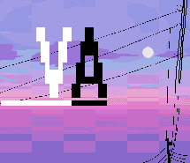

# GlitchVape



> **This is an entirely vibe-coded application.** It is a tool for me, the
> author, aimed at simplifying the application of filters and transformations.


Vaporwave and glitch-art transformations for photographs. Reads PNG, JPEG and
HEIC; writes stills or short looping animations.

```bash
glitchvape --preset vhs-decay Pictures/IMG_8111.HEIC
```

---

## Install

GlitchVape builds its own packages — an `.rpm` for Fedora, a `.deb` for
Debian and Ubuntu — and is installed from those, or it runs straight from a
clone of this repository.

**[docs/install.md](docs/install.md)** has both: the dependencies on each
distribution, building and installing the packages, and running from a clone.
[docs/packaging.md](docs/packaging.md) says what is in each package and how
they are built, and [docs/fonts.md](docs/fonts.md) which typefaces the
presets ask for and which of them ship.

---

## Usage

```bash
glitchvape [options] <input>

glitchvape -p vhs-decay -s 1337 photo.heic                   # a preset, a seed
glitchvape -p vhs-decay --set tracking.bands=12 photo.heic   # one parameter changed
glitchvape -p gameboy --fit 640x480 --colors 256 -o out/1995.bmp photo.heic
glitchvape -p sunset --animate -o loop.mp4 photo.heic        # a loop
glitchvape --list-effects                                    # and what there is
glitchvape --explain pixelsort
glitchvape-batch -p mallsoft -j 8 -r Pictures/               # a directory at once
```

**[docs/command-line.md](docs/command-line.md)** has every option, and what
`--fit`, `--colors` and `--codec` decide that their names do not say.

---

## Graphical interface

A window over the same pipeline: open a photograph, stack effects, watch
the preview, export a still or a loop. Everything it can do, the command
line can do too — `Copy command line` in the menu writes out the
invocation for whatever is on screen.

**[docs/interface.md](docs/interface.md)** covers it properly: the panes, the
menu, the export wizard, the settings popover, and the arrangements that
were tried and discarded on the way to this one.

---

## Presets

| Preset | |
|---|---|
| `vhs-decay` | third-generation dub, tape shedding oxide |
| `broadcast` | weak aerial, 2am, off-air |
| `mallsoft` | empty shopping centre, security-camera memory |
| `dreamcore` | overexposed, hazy, half-remembered |
| `hotline` | neon-noir, high contrast, blown highlights |
| `sunset` | synthwave horizon with grid and sun |
| `crt-terminal` | green phosphor monitor, close up |
| `gameboy` | four-tone handheld LCD |
| `photocopy` | faxed, photocopied, scanned back in |
| `deepfry` | reposted into oblivion |
| `datamosh` | decoder given the wrong frame |
| `anaglyph` | red/cyan misregistration, a 3D comic without the glasses |
| `arcade` | eight-bit game: chunky pixels, a hardware palette, dithered |
| `newspaper` | colour newsprint, screened at print angles and misregistered |
| `defrag` | the 1995 disk defragmenter, mid-pass, with the photograph on the disk |

A preset is a YAML file naming effects and their parameters, and `--set`
always wins over it, so a preset is a starting point rather than a commitment.
**[docs/presets.md](docs/presets.md)** has the format, how one preset
`extends` another, and where presets are looked for — including your own,
which is where the window's **Save as preset…** puts them.

---

## Effects

47 effects, sorted automatically into a signal chain. Order is not a free
choice — scanlines applied before a downsample get eaten by the resample — so
each effect declares a stage and the pipeline sorts by it.

| Stage | Shown as | Effects |
|---|---|---|
| **format** | Resolution & Format | `crop` `downsample` `bitmap` `defrag` |
| **colour** | Colour | `grade` `palette` `duotone` `gradient_map` `posterize` `quantize` |
| **channels** | Channel Separation | `chroma_shift` `rgb_shift` `chroma_bleed` |
| **damage** | Data Damage | `pixelsort` `databend` `blockshift` `slice` `vgatext` `deepfry` |
| **signal** | Signal & Tape | `wave` `tracking` `head_switch` `ghost` `vhold` `interlace` `dropout` `static` |
| **grain** | Grain & Dither | `grain` `dither` |
| **optics** | Screen & Optics | `scanlines` `grille` `bloom` `vignette` `curvature` `halftone` `cmyk` `glare` `softness` `flicker` |
| **overlay** | Overlays | `text` `osd` `grid` `watermark` `chicago` `stars` |
| **framing** | Framing | `letterbox` `maximised` |

**[docs/effects.md](docs/effects.md)** says why the stages are called what
they are, describes the effects worth knowing about before reaching for
`--explain`, and lists the palettes — moods, real hardware, and colours of
your own.

---

## Seeds

Effects draw randomness from a seeded generator, so the same `--seed` with the
same input reproduces a render exactly. Without one, a random seed is chosen
and printed on completion — a result worth keeping can always be reproduced.

Each effect gets its own *derived* stream. Adding or removing one effect does
not change what any other effect does, which means tuning a preset one
parameter at a time actually converges instead of reshuffling the whole image
on every edit.

---

## Animation

```bash
glitchvape -p vhs-decay --animate --frames 24 --fps 12 -o loop.mp4 photo.heic
glitchvape -p sunset --animate -o loop.gif photo.heic
```

The pipeline runs once per frame. Effects with a periodic component read their
position in the loop and complete exactly one cycle, so the result loops
seamlessly; effects driven by randomness get a fresh pattern each frame, so
static flickers rather than sitting still. The output extension picks the
encoder (`.mp4`, `.webm`, `.gif`).

### Audio

A loop can carry a soundtrack: an audio file, or one of five generated
tracks — dialling tones, radio static, a Geiger counter, a heartbeat, a hard
disk working. The loop repeats to cover the track rather than the track being
cut to the loop.

**[docs/audio.md](docs/audio.md)** has the flags, the generators and their
parameters, and how a mix of several tracks is balanced.

---

## Plug-ins

Effects, generated soundtracks, palettes, font roles and presets can come from
plug-ins as well as from the program. A plug-in is a Perl module called
`GlitchVape::Plugin::Name`, installed wherever Perl looks for modules — a
distribution package, `cpanm`, or `~/.local/share/glitchvape/lib/perl5` for
one of your own — and there is nothing to configure: what it adds turns up in
`--list-effects`, `--explain`, the presets and the window exactly as the
program's own does, with its name beside it.

```bash
glitchvape --list-plugins                   # what was found, what each adds, why any was refused
GLITCHVAPE_PLUGINS=none glitchvape …        # without any
GLITCHVAPE_PLUGINS=-Muffins glitchvape …    # without one
```

A plug-in that fails to load, breaks a rule, or wants a name something else
already has is refused on its own, with a warning saying why, and everything
else carries on. How to write one — the API, what it may add, and the checks
its own tests can run with `GlitchVape::Test` — is in
`perldoc GlitchVape::Plugins`.

---

## Library

`GlitchVape::render()` is the whole public surface; every front end calls
it with arguments in the same shape. Effects are declarations in
`lib/GlitchVape/Effect/`, and one declaration produces the command-line
flag, the help text, the preset key and the widget in the window.

**[docs/library.md](docs/library.md)** lists the modules and what each is
for, and covers the conventions for changing them.
**[CLAUDE.md](CLAUDE.md)** records the invariants and what enforces each.
